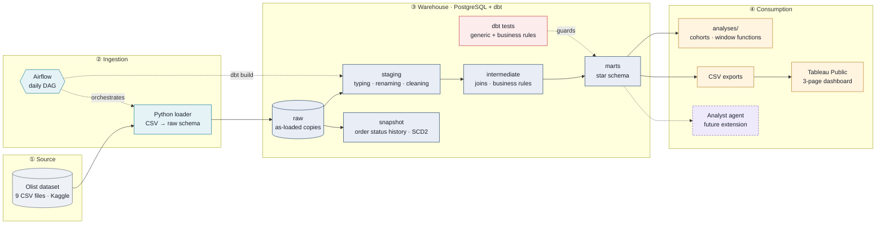
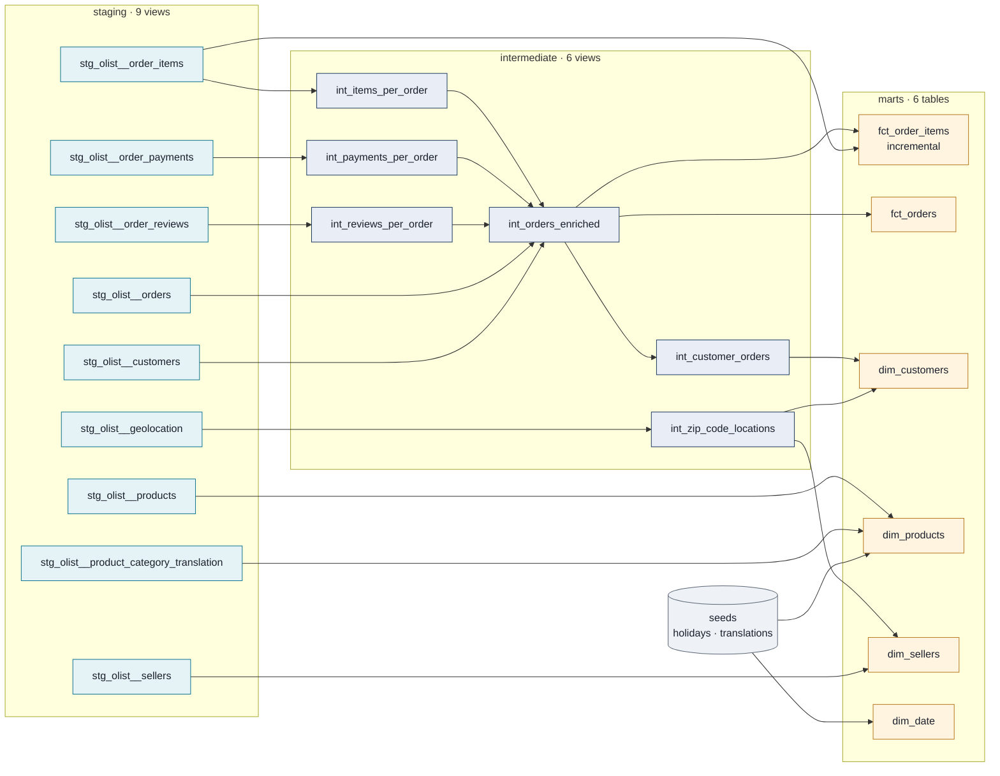
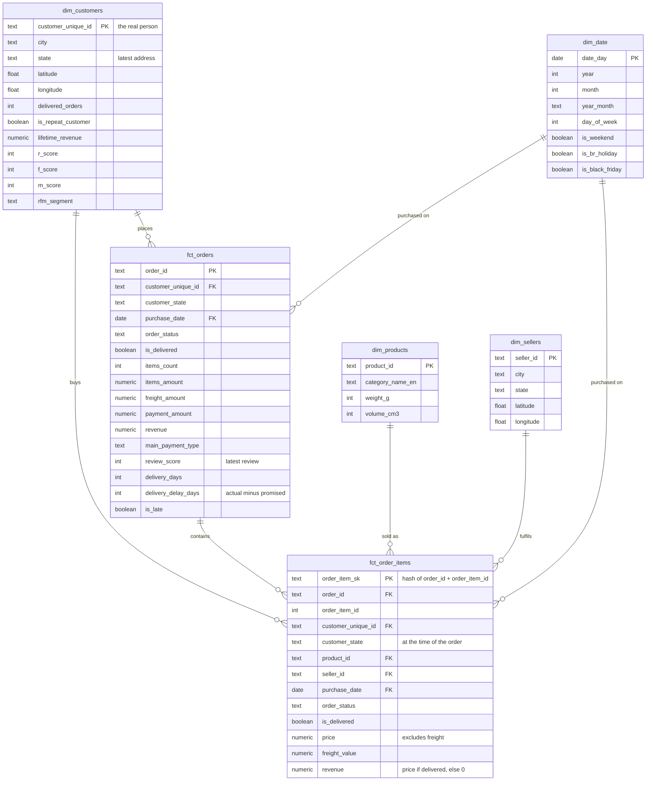

# Olist E-Commerce Data Platform

**Analytics Engineering & BI on 99,000+ real orders from a Brazilian marketplace.**
Raw CSVs in, tested star schema and business answers out — every KPI defined once, tested, and documented.


[](https://github.com/Samir-AISS/olist-ecommerce-data-platform/actions/workflows/ci.yml)


> [!NOTE]
> This project is being built in public, phase by phase. Sections marked 🚧 are filled in as each phase lands — see the [roadmap](#roadmap). No number in this README is typed by hand: every figure is produced by a query in this repository.

---

## Table of contents

- [The business problem](#the-business-problem)
- [Architecture](#architecture)
- [Data model](#data-model)
- [KPI definitions](#kpi-definitions)
- [Advanced SQL analyses](#advanced-sql-analyses)
- [Data quality](#data-quality)
- [Key findings](#key-findings) 🚧
- [Dashboard](#dashboard) 🚧
- [Quick start](#quick-start)
- [Tech stack](#tech-stack)
- [Repository structure](#repository-structure)
- [Roadmap](#roadmap)
- [Data source & license](#data-source--license)

---

## The business problem

A sales leadership team at Olist wants to steer the business, but the data is spread across **9 CSV files with multiple keys**. Different people compute "revenue" in different ways, and nobody trusts the numbers.

This project answers four questions with one shared, tested definition per metric:

| # | Business question | Where it is answered |
|---|---|---|
| 1 | **Why does revenue vary by region**, and what drove a decline in a given state? | `fct_order_items` × `dim_customers` · dashboard page *Sales* |
| 2 | **Do late deliveries hurt review scores**, and by how much? | `fct_orders` · `dbt/analyses/late_delivery_vs_reviews.sql` |
| 3 | **Which customers are worth retaining**, and how many ever come back? | `dim_customers` (RFM) · `dbt/analyses/monthly_cohorts.sql` |
| 4 | **Which categories and sellers drive revenue**, and which drive complaints? | `fct_order_items` × `dim_products` / `dim_sellers` |

**Success criterion:** the dashboard explains *"why did revenue drop in this region?"* in three clicks.

---

## Architecture



| Layer | Responsibility | Materialization |
|---|---|---|
| **raw** | Exact copy of the CSV files: every column is `TEXT`, streamed with `COPY` in one transaction, each load audited in `raw._load_audit`. | tables |
| **staging** (`stg_`) | One model per source table: cast types, rename to `snake_case`, trim and standardize values. No joins. | views |
| **intermediate** (`int_`) | Joins and business rules: aggregate payments and reviews per order, compute delivery delays. | views |
| **marts** (`fct_`, `dim_`) | Star schema consumed by BI and analyses. Explicit grain, fully tested. | tables · `fct_order_items` is **incremental** |
| **snapshots** | History of `order_status` changes (slowly changing dimension, type 2). | snapshot |

### dbt lineage



*The full, clickable lineage graph is generated by `make docs`.*

---

## Data model



| Table | Grain (one row per…) | Rows | Notes |
|---|---|---:|---|
| `fct_order_items` | **ordered item** (`order_id` + `order_item_id`) | 112,650 | Main fact table. **Incremental** (`delete+insert`), re-processes the last 30 days of purchases on each run. |
| `fct_orders` | **order** | 99,441 | Payment, latest review, delivery delay. |
| `dim_customers` | **customer** (`customer_unique_id`) | 96,096 | `customer_id` is regenerated **for every order**; `customer_unique_id` identifies the person. Using the wrong key would make every customer look like a one-time buyer. |
| `dim_products` | product | 32,951 | English category for every product (2 missing translations added by a seed, `unknown` when the source has none). |
| `dim_sellers` | seller | 3,095 | Coordinates for maps. |
| `dim_date` | calendar day | 1,096 | Brazilian national holidays (seed) and Black Friday. |

Row counts from `make run` on the full dataset.

**Two notions of "customer state".** Facts carry `customer_state` *at the time of the order*; `dim_customers.state` is the *latest* address. Revenue by region uses the first, so a customer who moves does not move past revenue with them.

### Order status history (SCD type 2)

`dbt/snapshots/snap_orders_status.yml` keeps one version of an order per status change, with `dbt_valid_from` / `dbt_valid_to`. Verified by simulating a delivery on a shipped order:

| order_status | order_delivered_customer_date | dbt_valid_from | dbt_valid_to |
|---|---|---|---|
| shipped | | 2026-10-09 00:08 | 2026-10-09 00:11 |
| delivered | 2018-09-01 10:00 | 2026-10-09 00:11 | |

Design choices are recorded as short ADRs in [docs/decisions.md](docs/decisions.md).

---

## KPI definitions

Each KPI is computed **in exactly one dbt model** and documented in [docs/kpi_dictionary.md](docs/kpi_dictionary.md): definition, SQL formula, exclusions, and the tests that guard it.

| KPI | Definition | Computed in | Value |
|---|---|---|---:|
| **Revenue** | Sum of item `price` for **delivered** orders. **Excludes freight** and undelivered orders. | `fct_order_items.revenue` | 13,221,498.11 BRL |
| **Average order value** | Revenue ÷ delivered orders. | `fct_orders` | 137.04 BRL |
| **Late delivery rate** | Delivered after the promised date ÷ delivered orders with a delivery date. | `fct_orders.is_late` | 6.77 % |
| **Average review score** | Mean score (1–5) of reviewed orders; latest review wins. | `fct_orders.review_score` | 4.09 |
| **Repeat purchase rate** | Customers (`customer_unique_id`) with ≥ 2 delivered orders ÷ customers with ≥ 1. | `dim_customers.is_repeat_customer` | 3.00 % |
| **RFM segment** | Recency and monetary quintiles (`NTILE`), frequency bands, combined into 7 named segments. | `dim_customers.rfm_segment` | [see findings](docs/findings.md) |

Values computed by [`dbt/analyses/01_kpi_summary.sql`](dbt/analyses/01_kpi_summary.sql) on the full dataset.

## Advanced SQL analyses

Nine versioned queries in [`dbt/analyses/`](dbt/analyses/), compiled by dbt (so they use `ref()` and the same models as the dashboard) and executed by `make findings`, which regenerates [docs/findings.md](docs/findings.md).

| Query | SQL techniques |
|---|---|
| `02_revenue_by_state` | `rank()`, share of total with `sum() over ()` |
| `03_revenue_by_state_monthly` | month-over-month change with `lag()` |
| `04_late_delivery_vs_reviews` | bucketing with `case`, conditional averages |
| `05_monthly_cohorts` | cohort retention, `count(*) filter (where …)` pivots |
| `06_category_pareto` | running total `sum() over (order by … rows between unbounded preceding and current row)` |
| `07_seller_concentration` | `ntile(10)` deciles |
| `08_rfm_segments` | segment sizing with window shares |
| `09_black_friday` | join to the date dimension |

---|---|---|
| **Revenue** | Sum of item `price` for **delivered** orders. **Excludes freight** and cancelled or unavailable orders. | `fct_order_items` |
| **Average order value** | Revenue ÷ number of distinct delivered orders. | `fct_orders` |
| **Late delivery rate** | Delivered orders where the actual delivery date is after the estimated date ÷ delivered orders. | `fct_orders` |
| **Average review score** | Mean of the order's review score (1–5). Orders with several reviews keep the most recent one. | `fct_orders` |
| **Repeat purchase rate** | Customers (`customer_unique_id`) with ≥ 2 delivered orders ÷ customers with ≥ 1. | `dim_customers` |
| **RFM segment** | Recency, frequency and monetary scores (`NTILE`) combined into named segments. | `dim_customers` |

---

## Data quality

Tests run on every `dbt build`, locally and in CI. A failing test blocks the build. Current result on the full dataset: **127 nodes, PASS=125, WARN=2, ERROR=0**.

| Type | What it guarantees | Examples |
|---|---|---|
| **Generic tests** | Keys are sound | `unique` + `not_null` on every primary key · `relationships` from each fact to its dimensions · `accepted_values` on `order_status` |
| **Grain test** | No duplicated facts | Fails if an `order_id` + `order_item_id` pair appears twice in `fct_order_items` |
| **Business rules** | Numbers reconcile | Revenue identical from `fct_order_items` and `fct_orders` · no revenue from undelivered orders · every staging item reaches the fact table · amount paid covers items + freight |
| **Code quality** | Readable, consistent code | `ruff` (Python) · `sqlfluff` (SQL) · `pre-commit` hooks |

### What the tests found in the source data

Measured on the full dataset by `make run` (staging: 9 models, 48 tests). Source anomalies are **flagged, not deleted**, so no order silently disappears.

| Finding | Count | How it is handled |
|---|---:|---|
| Zip codes starting with `0` | 23,995 customers | Kept as text in `raw` and staging (a numeric cast would drop the zero) |
| `review_id` values shared by several orders | 814 | Key is `review_id` + `order_id`, tested with `unique_combination_of_columns` |
| Orders handed to the carrier **before** they were placed | 166 | Test with `severity: warn`: visible in every build, does not block it |
| Geolocation points outside Brazil | 42 | Flagged with `is_in_brazil = false` |
| Seller city spellings (`"sao paulo / sao paulo"`, `"lages - sc"`) | 611 → 593 distinct | Normalized by the `clean_city_name` macro |
| Products without a category | 610 | Kept; `category_name_en = 'unknown'` in `dim_products` |
| Orders paid **less** than items + freight (by > 1 BRL) | 17 | Test warns on any, fails above 100 (`warn_if` / `error_if`) |

Payments match items + freight to the cent for 98,362 of the 98,665 orders that have both; most of the remaining overpayments (229 of 232) are instalment plans, where interest is added.

---

## Key findings

🚧 *Filled in phase 5.* Each finding will link to the query in `dbt/analyses/` that produced it, so anyone can re-run it with one command.

---

## Dashboard

🚧 *Built in Tableau Public in phase 5 — three pages:*

| Page | Audience | Answers |
|---|---|---|
| **Executive** | Leadership | Revenue, orders, AOV and late-delivery trends at a glance |
| **Sales** | Sales managers | Revenue by state, category and seller, with drill-down |
| **Customers** | CRM team | RFM segments, monthly cohorts, repeat purchase rate |

---

## Quick start

**Prerequisites:** Docker Desktop, [uv](https://docs.astral.sh/uv/) and GNU Make. No Kaggle account needed: the public dataset is downloaded automatically.

```bash
git clone https://github.com/Samir-AISS/olist-ecommerce-data-platform.git
cd olist-ecommerce-data-platform

make setup              # Python env (uv) + pre-commit hooks + .env from .env.example
make up                 # start PostgreSQL in Docker and wait until healthy
make run                # download the 9 CSV files → load raw → dbt build (models + tests)
make findings           # run the SQL analyses → docs/findings.md
make docs               # browse the dbt documentation and lineage graph on localhost:8081
```

| Command | What it does |
|---|---|
| `make test` | Unit tests + integration tests against PostgreSQL (`pytest`) |
| `make lint` / `make format` | `ruff` + `sqlfluff` checks / fixes |
| `make build` | `dbt build` only: run every model and its tests |
| `make sample` | Rebuild the 500-order CI sample in `data/sample/` |
| `make down` / `make reset-db` | Stop containers / also delete the database volume |
| `make help` | List every command |

### Raw layer after `make run`

Row counts printed by `ingestion/load_raw.py` on the full dataset:

| Table | Rows |
|---|---:|
| `raw.geolocation` | 1,000,163 |
| `raw.order_items` | 112,650 |
| `raw.order_payments` | 103,886 |
| `raw.customers` | 99,441 |
| `raw.orders` | 99,441 |
| `raw.order_reviews` | 99,224 |
| `raw.products` | 32,951 |
| `raw.sellers` | 3,095 |
| `raw.product_category_name_translation` | 71 |
| **Total** | **1,550,922** |

> `wc -l` reports 104,719 lines for the reviews file: some review comments span several lines. Loading with a real CSV parser (`COPY`) gives the correct 99,224 reviews.

---

## Tech stack

| Tool | Role | Why this choice |
|---|---|---|
| **PostgreSQL** (Docker) | Warehouse | Free, standard SQL, runs anywhere |
| **dbt Core** | Transformations, tests, docs, lineage | The core Analytics Engineering tool: SQL with versioning, tests and documentation |
| **Python + uv** | CSV ingestion, tooling | Fast, reproducible environments |
| **Airflow** | Daily orchestration | Shows how the pipeline is scheduled and monitored in production |
| **Tableau Public** | BI dashboard | Free, shareable public link |
| **ruff · sqlfluff · pytest · pre-commit** | Code quality | Consistent style and safety net before every commit |
| **GitHub Actions** | CI | Lint, tests, load of a 500-order sample, `dbt build` and every analysis on every pull request |

---

## Repository structure

```text
olist-ecommerce-data-platform/
├── ingestion/                  # load the CSV files into the raw schema
├── dbt/
│   ├── models/staging/         # stg_olist__*: one model per source table
│   ├── models/intermediate/    # int_*: joins and business rules
│   ├── models/marts/           # fct_* and dim_*: the star schema
│   ├── snapshots/              # order status history (SCD2)
│   ├── analyses/               # advanced SQL: cohorts, window functions, findings
│   ├── seeds/                  # Brazilian holidays, missing category translations
│   ├── macros/                 # clean_city_name, schema naming
│   └── tests/                  # singular business-rule tests
├── dags/                       # Airflow daily DAG
├── dashboard/                  # Tableau exports, screenshots, public link
├── scripts/                    # make_sample.py (CI sample), run_analyses.py (findings)
├── data/sample/                # 500-order sample committed for CI
├── tests/                      # Python tests
├── docs/
│   ├── decisions.md            # architecture decision records
│   ├── findings.md             # generated by make findings
│   └── kpi_dictionary.md       # one definition per KPI
├── docker-compose.yml · Makefile · pyproject.toml
└── README.md
```

---

## Roadmap

| Phase | Scope | Verifiable deliverable | Status |
|---|---|---|---|
| 1 | Project skeleton: Docker, ingestion, tooling, CI | `make setup && make up && make run` loads the raw schema | ✅ |
| 2 | dbt sources + staging layer, naming conventions | `dbt build` green on staging | ✅ |
| 3 | Intermediate + star schema, incremental model, snapshot, tests | Documented star schema, grain test passing | ✅ |
| 4 | KPI dictionary + advanced SQL analyses | `docs/kpi_dictionary.md`, `dbt/analyses/` | ✅ |
| 5 | Tableau exports, dashboard, findings, dbt docs | Public dashboard link + findings in this README | ⬜ |

---

## Data source & license

- **Data:** [Brazilian E-Commerce Public Dataset by Olist](https://www.kaggle.com/datasets/olistbr/brazilian-ecommerce) (2016–2018), published under [CC BY-NC-SA 4.0](https://creativecommons.org/licenses/by-nc-sa/4.0/). The data is **not** stored in this repository; it is downloaded at setup.
- **Code:** [MIT](LICENSE).

---

## Author

**Samir EL AISSAOUY** · Data Engineer · Analytics Engineer

[](https://www.linkedin.com/in/samir-el-aissaouy)
[](mailto:elaissaouy.samir12@gmail.com)
